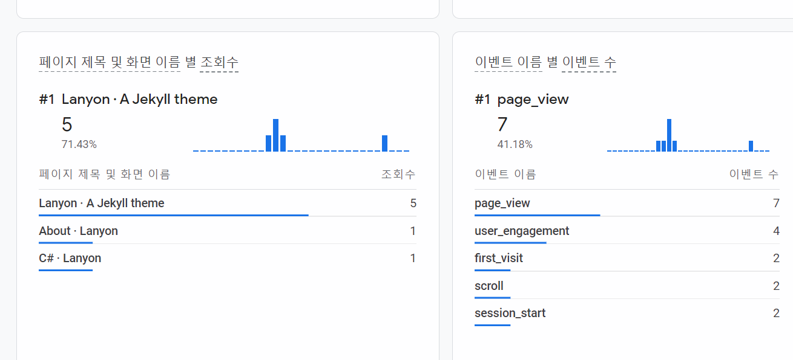

# 깃 블로그를 만들었던 과정 소개


---

## 1. repo 만들기
우선 github blog 페이지를 만들기 위해 가장 먼저 
저의 아이디와 github.io를 합친 jch618.github.io 라는 이름의 레포지토리를 만들어 주었습니다.

그 후에 git bash를 열고
`git clone https://github.com/jch618/jch618.github.io`
명령어를 이용해서 로컬 저장소에 레포지토리를 가져왔습니다.

## 2. jekyll 깔기
github 블로그를 정적 웹사이트로 만들어주는 jekyll를 다운 받기 위해서
우선 <https://rubyinstaller.org/downloads/>에 들어가 알맞은 파일을 설치한 후에
명령 프롬프트 창을 열고 `gem install jekyll bunder` 를 사용하여 jekyll을 설치한 후에
`jekyll -v`를 사용해서 설치가 잘 되었는지 확인하였습니다.

## 3. 테마 적용하기
제가 선택한 테마는 *jekyll-gitbook*테마입니다.
우선 <https://github.com/sighingnow/jekyll-gitbook> 다음 사이트에 접속하여
`git clone` 명령어를 이용해서 로컬 레포지토리에 가져온 뒤
파일들을 복사하여 1번에서 미리 만들어두었던 jch618.github.io 로컬 레포지토리에 붙여넣었니다.
그러나 처음 몇 번 동안 파일들을 붙여넣은 후 `jekyll serve`를 했을 때
라이브러리 오류가 발생하여 몇 번의 시도 끝에 `bundle update`와 `bundle install` 명령어를 
이용하여 추가적인 파일들을 다운로드하고 난 후에야 오류가 발생하지 않는다는 사실을 알게 되었습니다.

아무튼 이렇게 테마를 적용한 후에는 `git add`, `git commit`, `git push` 명령어를
사용하여 원격 레포지토리에 저장했습니다.

또한 github의 **settings-pages**에 들어가 저의 사이트의 주소가 https://jch618.github.io/로 되어있는 것도 확인했습니다.

## 4. 댓글 적용하기
**댓글** 기능을 적용하기 위해 저는 **disqus**를 사용하였습니다.
*[disqus 사이트](https://disqus.com/)* 에 접속하여 가입한 뒤
**Admin** 페이지에 접속하여 새로운 사이트를 추가하였습니다. 저 같은 경우에는 웹사이트 이름을 'dolmangs'로 지정하였습니다.
각종 설정 후에 **Installing Disqus**페이지에 들어가 **jekyll**을 선택한 후
[Universal Embed Code](https://dolmangs.disqus.com/admin/install/platforms/universalcode)에 들어가 나와있는 코드를 복사하여
저의 로컬 repo에 `_config.yml`파일의 하단에

`
comment: 
  provider:         "disqus"
  disqus:
    shortname:      "dolmangs"
`

와 같은 코드를 추가해주고 

`_layouts/post.html` 파일에 하단의 아까 복사했던 코드와 조건이 담긴 약간의 코드를 더하여
파일의 하단에 추가해주었습니다.


## 기타


layon 테마를 적용하고 나니 저절로 **사이드 메뉴**에 **Downloads**와 **Github-page**라는 항목이 생겼는데
이들 모두 제대로 설정되어있지 않아 접속할 때 *404Error*를 발생시켰습니다. 저는 `_includes/sidebar.html` 파일에서
이를 수정할 수 있다는 것을 친구를 통해 알게 되었고 저는 과감히 **Downlads**와 **Github-page**메뉴를 삭제해서
이 문제를 해결하였습니다.


## 5. Google Analytics 적용하기

우선 **google analytics**를 적용하기 위하여 [google analytics]<www.google.com/analytics>에 접속하여
회원가입을 하고 내 계정을 만든 다음 데이터 스트림을 만들었습니다.

그 후에 `tracking ID`를 `_config.yml` 파일에 `google-analytics` 다음과 같이 저장해주고
`includes/` 디렉토리에 들어가 **google-analytics.html** 파일을 만든 후 파일 안에


``` HTML
<!-- Global site tag (gtag.js) - Google Analytics -->
<script async src="https://www.googletagmanager.com/gtag/js?id={{ site.google-analytics }}"></script>
<script>
  window.dataLayer = window.dataLayer || [];
  function gtag(){dataLayer.push(arguments);}
  gtag('js', new Date());

  gtag('config', '{{ site.google-analytics }}');
</script>
```

다음과 같은 코드를 삽입하고 `_includes/head.html`파일에 들어가 `<head>`바로 
아랫 부분에 `` 다음과 같은 코드를 삽입하여
`google-analytics.html`파일을 불러오도록 하였습니다.


이 내용을 커밋한 후에 <jch618.github.io>를 몇 개의 기기로 접속한 후
google analytics 사이트의 **보고서**항목을 살펴보니



다음과 같이 사용자가 접속한 기록이 남아 있음을 확인할 수 있었습니다.


그럼 제 글을 읽어주셔서 감사합니다.


